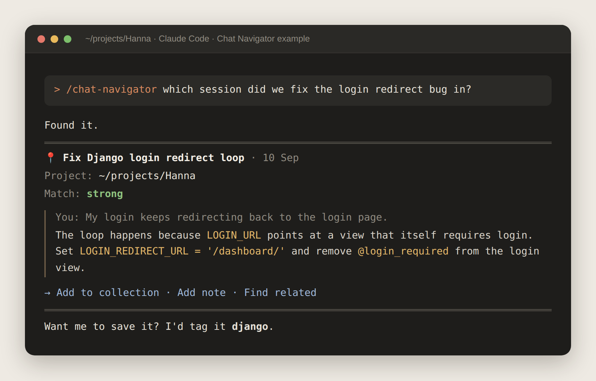
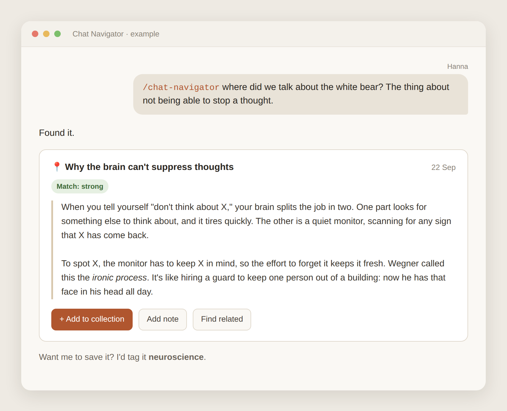

# Chat Navigator

**Works in both Claude Code and the Claude app (chat).**

A skill for Claude that searches **all your past Claude sessions and chats at once**, from any new one, and saves the best parts for later.

You know the feeling: "We fixed this exact bug last month… but which session was it?" Chat Navigator finds it for you.

**No need to remember where it was.** Start a new session, ask for what you remember, and it looks through your whole history for you. Install it once, and it works every time after that.



*In Claude Code: it finds the old session, the project it was in, and the fix.*

---

## Where it works

The skill notices where you are and adjusts by itself. You install the same skill in both places.

| Where you use it | What it searches | Where your collection is saved |
|---|---|---|
| **Claude Code** | Your past Claude Code sessions on this computer | A file on your computer |
| **Claude app** (web, desktop, mobile) | Your past chats in the app | Your Claude memory |

The two don't mix: Claude Code can't see your app chats, and the app can't see your Claude Code sessions.



*The same skill in the Claude app: it finds an old chat by meaning. (An illustration: in Claude, the options under a result appear as text, and you pick one by typing it, e.g. "add to collection".)*

---

## What it does

**1. Searches across all your sessions and chats.**
Not just the one you're in: it looks through all your past conversations. Describe what you remember, and it finds it.

> *"Which session did we fix the login redirect bug in?"*
>
> *"Find where we talked about why you can't stop thinking about something"*

**2. Shows you the part you were looking for.**
You get the passage itself, plus the title and date so you can find the original.

**3. Saves what you want to keep.**
Say "add to collection" and the passage goes into your personal review collection. Later, say "show collection" to see everything you saved.

---

## How to install

### In Claude Code

You need **Python 3** on your computer (most Macs and Linux computers already have it).

Copy this repo into your personal skills folder. On Mac or Linux, run:

```bash
git clone https://github.com/dBlueSk/claude-chat-navigator.git ~/.claude/skills/chat-navigator
```

On Windows, the folder is `%USERPROFILE%\.claude\skills\chat-navigator`.

No git? Click **Code → Download ZIP** on this page and unzip it. Rename the folder from `claude-chat-navigator-main` to `chat-navigator`, and put it in the place above.

That's it. Start a new Claude Code session to use it.

### In the Claude app

1. In **Settings**, turn on:
   - **Search and reference chats**: lets Claude look through your past conversations.
   - **Memory**: lets Claude keep your collection from one chat to the next. (Without it, searching still works; only saving doesn't.)
2. Download **`chat-navigator.skill`** from this page.
3. Open **Settings → Capabilities → Skills**, click **Add** (or **Upload skill**) and choose the file.
4. Make sure the skill is switched on.

That's it. Start a new chat to use it.

---

## How to use it

Start your message with `/chat-navigator`, or just ask naturally:

| You say | What happens |
|---|---|
| `/chat-navigator login redirect bug` | Searches for that topic |
| "Find where we talked about…" | Same thing, in plain words |
| "Add to collection" | Saves the result you're looking at |
| "Add note: …" | Attaches your own note to a saved passage |
| "Find related" | Looks for other sessions or chats about the same idea |
| "Show collection" | Lists everything you saved, grouped by tag |
| "Show my django entries" | Shows only one tag |
| "Remove [title]" | Deletes a saved passage |
| "Export my collection" | Turns your collection into a document you can keep |

---

## Good to know

**Everywhere**

- **It only shows what really exists.** If nothing matches, it tells you and suggests other words to try. It never makes up a passage.
- **Nothing is saved unless you ask.** Search results stay in the chat. Only "add to collection" keeps them.
- **Your collection is private.** Nobody else can see it.
- **Old chats are treated as information, not orders.** If an old passage contains instructions (say, text copied from a website), Claude shows it but never acts on it.
- **Can't find something?** Try other words, or mention roughly when it was ("last week", "in my Django project").

**In Claude Code**

- **It searches sessions on this computer only.** Sessions from another computer aren't there.
- **It works with words, so give it clues.** Mention a library, an error message, or a file name if you remember one. Claude also tries several phrasings for you.
- **It skips the session you're in**, since you can already see it.
- **It only reads.** It never changes or deletes your session files, runs no other programs, and uses no internet.
- **It hides secrets.** Anything that looks like a password, API key or token in an old session is shown as `[hidden]`.
- **Your collection is a file** at `~/.claude/chat-navigator/collection.md`. You can open it in any text editor.

**In the Claude app**

- **Chats inside Projects are searched separately.** In a normal chat, it searches all your chats that aren't in a Project. Inside a Project, it searches only that Project's chats. So if you're looking for something from a Project, ask from inside that Project.

---

## Files in this folder

- `SKILL.md`: the instructions Claude follows. You don't need to edit it.
- `scripts/search_sessions.py`: the small search tool used in Claude Code.
- `chat-navigator.skill`: the ready-to-install package for the Claude app.
- `demo.png` and `demo-code.png`: the example pictures on this page.
- `LICENSE`: says you're free to use, change and share this skill.

---

## Want to help?

Ideas and fixes are welcome.

- **Found a problem or have an idea?** Open an [issue](../../issues). Describe what you asked, what you expected, and what happened, and say whether you were in the Claude app or Claude Code. No coding needed.
- **Want to change the skill yourself?** Open an issue first to talk about the idea. Then edit `SKILL.md` (or the script) in your own copy (a *fork*) and send a pull request.
- **Keep changes small**, one improvement at a time. That makes them easier to check and accept.
- **Never include real chat content** from your own history in an issue or pull request. Use made-up examples instead.

---

## License

MIT. Free to use, change and share. See [LICENSE](LICENSE).

Made by [Hanna](https://github.com/dBlueSk), built with the help of [Claude](https://claude.ai).

*This is a community project, not an official Anthropic product.*
